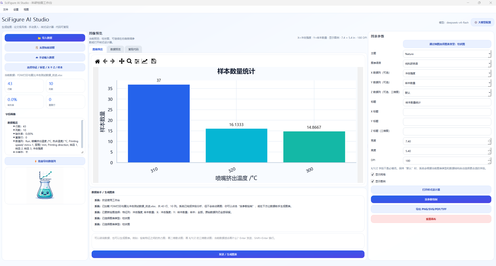
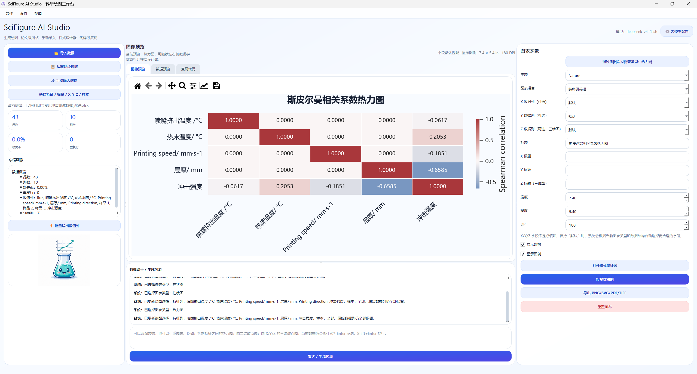
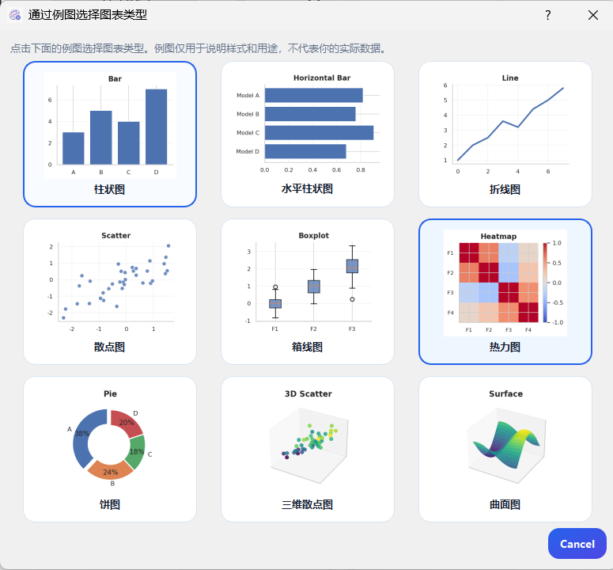

# SciFigure AI Studio 2.1

> AI 科研绘图桌面软件：从表格数据到论文级图表，一站完成 **数据导入 → 生成绘图 → 参数精修 → 复现代码 → 多格式导出**。

SciFigure AI Studio 是一个面向科研、论文写作、实验报告和数据分析场景的桌面绘图工具。用户可以导入 CSV、Excel、JSON、Parquet，也可以直接在软件中手动输入 X/Y 数据或粘贴 Excel 表格；随后通过自然语言描述绘图需求，由大模型生成安全的绘图方案 `ChartSpec`，再交给本地可信绘图引擎渲染图表。

与传统“让 AI 直接写并执行 Python 代码”的方式不同，本项目采用：

```text
数据表格 → 用户绘图需求 → 大模型生成 ChartSpec → 本地绘图引擎渲染 → 参数面板精修 → 导出/复现
```

这样既保留了自然语言绘图的灵活性，也提升了安全性、稳定性和可复现性。

---

## 功能亮点

### 1. 生成绘图

- 输入自然语言需求即可生成科研图。
- 支持大模型生成绘图方案，也支持无 API Key 时本地规则推荐。
- 模型只返回结构化 JSON，不直接执行任意代码。
- 生成失败时自动回退到本地推荐，避免流程中断。


### 2. 多方式数据导入

支持以下导入方式：

- CSV / TXT
- Excel `.xlsx` / `.xls`
- JSON
- Parquet
- 剪贴板表格
- 软件内手动输入 X/Y 数据
- 从 Excel 复制表格后直接粘贴

手动输入示例：

```text
Sample Group Value
A Control 1.2
B Control 1.5
C Treatment 2.4
D Treatment 2.8
```

### 3. 大模型配置窗口

软件内提供 **⚙️ 大模型配置** 按钮，用户可以自由配置：

- API Key
- Base URL
- Model Name
- Timeout
- OpenAI / DeepSeek / DeepSeek Reasoner / 自定义 OpenAI-compatible 服务
- 本地规则模式

无需修改代码即可切换不同模型服务。

### 4. 论文级图表参数面板

支持在右侧参数面板中精修：

- 图表类型
- 图表语言：纯科研英语 / 中文
- 主题模板：Nature / Science / IEEE / Modern / Dark / Minimal
- X、Y、Y2、Hue 列选择
- Error Bar 列选择
- 聚合方式：none / mean / median / sum / count
- 标题、X 轴标题、Y 轴标题
- 图像尺寸、DPI
- 网格、图例、对数坐标

### 5. 支持的图表类型

- 散点图
- 折线图
- 柱状图
- 水平柱状图
- 直方图
- 箱线图
- 小提琴图
- 相关矩阵
- 热力图
- 回归图
- 误差棒
- 双 Y 轴
- 面积图
- 饼图
- KDE 密度图

### 6. 出图与复现

- 导出 PNG / SVG / PDF / TIFF
- 支持 600 DPI 论文级导出
- 每次绘图自动生成可复制 Python 复现代码
- 支持批量导出多个数值列图表

---

## 软件截图建议

建议在仓库中放置以下截图，便于展示项目效果：

```text
images/
  home.png              # 主界面
  llm_config.png        # 大模型配置窗口
  manual_input.png      # 手动输入数据窗口
  chart_preview.png     # 图表预览
  code_export.png       # 复现代码界面
```

README 中可插入：

```html
<div align="center">
  
</div>
```

---

## 快速启动：开发版双击运行

如果你只是自己使用或开发调试，可以直接双击：

```text
启动软件.bat
```

该脚本会自动完成：

1. 创建 `.venv` 虚拟环境
2. 安装 `requirements.txt`
3. 启动 `python main.py`

> 注意：这种方式要求电脑已安装 Python 3.9+，并且安装 Python 时勾选了 `Add Python to PATH`。

---

## 打包成可双击打开的 EXE

如果你想发给别人使用，推荐在 Windows 电脑上执行：

```text
打包成EXE.bat
```

打包完成后，程序位置为：

```text
dist/SciFigure AI Studio/SciFigure AI Studio.exe
```

你可以把整个文件夹：

```text
dist/SciFigure AI Studio/
```

压缩成 zip 发给别人。用户解压后双击：

```text
SciFigure AI Studio.exe
```

即可打开软件。

### 为什么推荐“文件夹版”而不是“单文件版”？

PyQt5、Matplotlib、Pandas 依赖较多，单文件 EXE 首次启动会较慢，也更容易被杀毒软件误报。正式分发建议使用文件夹版。

如果确实想生成单文件 EXE，可以运行：

```text
build_tools/build_windows_onefile.bat
```

生成位置：

```text
dist/SciFigure AI Studio.exe
```

---

## 常规命令行运行

```bash
cd SciFigureAIStudio
python -m venv .venv

# Windows
.venv\Scripts\activate

# macOS / Linux
source .venv/bin/activate

pip install -r requirements.txt
python main.py
```

---

## 大模型配置

启动软件后，点击右上角：

```text
⚙️ 大模型配置
```

### OpenAI 示例

```env
AI_FIGURE_BASE_URL=https://api.openai.com/v1
AI_FIGURE_MODEL=gpt-4.1-mini
AI_FIGURE_API_KEY=你的 OpenAI Key
AI_FIGURE_TIMEOUT=60
```

### DeepSeek 示例

```env
AI_FIGURE_BASE_URL=https://api.deepseek.com
AI_FIGURE_MODEL=deepseek-chat
AI_FIGURE_API_KEY=你的 DeepSeek Key
AI_FIGURE_TIMEOUT=60
```

### 本地规则模式

如果不填写 API Key，软件会自动进入本地规则模式：

- 不调用外部模型
- 根据数据列类型自动推荐图表
- 可继续手动调整参数和导出图表

---

## 推荐提示词

```text
绘制模型名称和测试集平均 R2 的柱状图，按照打印方向分组，使用论文风格。
```

```text
Plot a regression figure between training RMSE and testing RMSE with a clean Nature style.
```

```text
根据所有数值列绘制相关性热力图，标题使用纯科研英语。
```

```text
比较不同模型的测试集 MAE，用箱线图展示，并显示网格。
```

---

## 目录结构

```text
SciFigureAIStudio/
  main.py                       # 程序入口
  requirements.txt              # 运行依赖
  build_requirements.txt        # 打包依赖
  .env.example                  # 大模型配置模板
  启动软件.bat                  # 开发版双击启动器
  打包成EXE.bat                 # Windows 文件夹版 EXE 打包器
  SciFigureAIStudio.spec        # PyInstaller 打包配置
  build_tools/
    build_windows_folder.bat    # Windows 文件夹版打包
    build_windows_onefile.bat   # Windows 单文件版打包
    build_macos_app.sh          # macOS app 打包脚本
    build_linux_appimage_note.sh# Linux 可执行文件打包脚本
  docs/
    PACKAGING.md                # 打包说明
  scifigure/
    app.py                      # 主窗口和 UI 交互
    charting.py                 # ChartSpec 与本地绘图引擎
    llm.py                      # OpenAI-compatible 大模型调用
    dialogs.py                  # 配置弹窗、手动数据录入弹窗
    data_model.py               # 数据加载、数据画像、表格模型
    codegen.py                  # 复现代码生成
    workers.py                  # 后台线程
    styles.py                   # QSS 外观样式
    widgets.py                  # 自定义控件
```

## 技术栈

- Python 3.9+
- PyQt5
- Pandas / NumPy
- Matplotlib / Seaborn
- Requests
- python-dotenv
- PyInstaller

---

## 开源协议

本项目可继续沿用 MIT License。请在发布时保留 LICENSE 文件。

## v2.4 界面与样式更新

- 右侧参数区已移除列选择项：X / 标签、Y、Y2、分组 Hue、聚合。
- 右侧参数区保留：标题、X 标题、Y 标题，用于修改图表标题和坐标轴标题。
- 图表列选择主要由“生成图表”指令和智能推荐完成，例如“用 A 列作为横轴，B 列作为纵轴画散点图”。
- 图表样式设计器已中文化：配色方案、线类型、点类型、背景风格、数值标签。
- 软件窗口图标使用 `assets/pixel_style.png`。
- 第一张机器人电脑素材不再使用，也不放入资源包。

## v2.5 核心五图版更新

当前版本先收敛到五种核心图表，便于把数据适配和绘图质量做好：

- 柱状图
- 折线图
- 散点图
- 热力图
- 饼图

关键逻辑：

- “生成图表”按钮已去掉左侧表情，界面更正式。
- 图表类型下拉框只保留五种图表。
- 大模型只允许返回五种图表之一，不再让模型生成其它未完善图表。
- 散点图必须至少有两个数值列，否则弹窗提示“不适合绘制”。
- 折线图需要一个数值 Y 列，X 优先选择时间列、序号列或第一列。
- 柱状图会自动选择分类列 / 低基数分组列，并按类别聚合数值列均值，最多显示前 20 类，避免一堆混乱柱子。
- 饼图会自动按类别聚合数值列，要求数值非负，最多显示前 10 类。
- 热力图会先基于数值列计算 Spearman 相关系数，再绘制相关性热力图；少于两个数值列会弹窗提示不适合绘制。

## v2.6 数据助手与分图表样式器更新

- 下方输入框不再局限于“绘图指令”，现在可以咨询当前导入的数据，例如“有哪些缺失值？”、“当前数据适合画什么图？”。
- 如果用户明确要求绘图，例如“绘制特征之间的热力图”，助手会读取当前 Excel/CSV 的字段、类型、缺失率和样例后再决定图表方案。
- “适合画什么图？”会优先走数据咨询，不会被硬解析成绘图。
- 热力图默认用于数值特征之间的相关性分析，并优先使用 Spearman 相关系数；样式器里可改为 Pearson 或 Kendall。
- 折线图默认不再显示散点节点，只显示连续趋势线；如确实需要节点，可在折线图样式器里手动开启“显示节点标记”。
- 样式设计器会根据当前图表类型显示不同选项：折线图显示线型/线宽，散点图显示点类型/点大小，柱状图显示类别数量，饼图显示环形图与类别数量，热力图显示相关系数类型。

## v2.7 数据选择与热力图清晰度更新

- 新增“选择特征/标签/样本”功能：导入表格后，可自主勾选特征列、选择标签列，并限制样本数量。
- 热力图逻辑增强：默认基于数值特征计算相关系数；特征过多时自动按方差筛选前 N 个特征，避免所有文字和色块挤在一起。
- 热力图样式器新增：
  - 相关系数：自动 / Spearman / Pearson / Kendall
  - 最多显示特征数
  - 是否显示相关系数数值
- 右侧参数区已移除：
  - 误差列
  - X 对数
  - Y 对数
  - 按 X 排序
- 对话输入框为空时不会发送，会提示用户先输入数据咨询或绘图需求。
- 默认 DPI 提高到 180，图表导出和预览更清晰。
- 折线图继续保持默认不显示散点节点；需要节点时可在样式器中开启。

## v2.8 X/Y/Z 字段选择、归一化与三维图更新

- “选择特征/标签/样本”窗口升级为“选择特征 / 标签 / X-Y-Z / 样本”：
  - 可勾选特征列
  - 可选择标签列
  - 可指定图表 X 字段
  - 可指定图表 Y 字段
  - 可指定图表 Z 字段（三维散点图 / 曲面图使用）
  - 可限制样本数量
  - 可选择前 N 行或随机 N 行
  - 可对当前筛选后的绘图数据做 Min-Max 或 Z-score 归一化
- 新增图表类型：
  - 三维散点图：需要 X/Y/Z 三个数值列
  - 曲面图：需要 X/Y/Z 三个数值列，适合连续采样或较密集三维数据
- 热力图相关系数默认显示 4 位小数，避免弱相关被四舍五入成 0.00。
- 热力图若仍显示接近 0，通常表示特征之间相关性确实很弱，或样本量/数据分布不支持显著相关。
- 样式设计器新增：
  - 热力图小数位数
  - 三维散点图点类型 / 点大小
  - 曲面图透明度 / 辅助点大小
- 右侧参数区增加“Z 标题（三维图）”，用于三维散点图和曲面图。

## v3.0 图表例图选择与灵活特征配置更新

- 下方 AI 区域初始系统提示改为：欢迎使用工作台。
- X/Y/Z 字段默认项从“自动”改为“默认”。
- 右侧参数区保留“显示图例”开关，用户可以决定图表是否显示图例。
- 散点图不再自动添加拟合线，只保留散点。
- “选择特征 / 标签 / X-Y-Z / 样本”不再裁剪原始数据列：
  - 未勾选的特征仍然保留在当前数据表中
  - 下次打开仍可重新选择所有字段
  - 特征勾选结果只作为当前绘图配置使用
- 采样、归一化、特征选择都改为渲染配置，不直接破坏原始导入数据。
- 新增图表类型例图选择窗口：
  - 点击“通过例图选择图表类型”
  - 每个图表类型都有示例图
  - 例图下面显示图表类型名称
- 新增素材目录：
  - assets/chart_examples/bar.png
  - assets/chart_examples/line.png
  - assets/chart_examples/scatter.png
  - assets/chart_examples/heatmap.png
  - assets/chart_examples/pie.png
  - assets/chart_examples/scatter3d.png
  - assets/chart_examples/surface.png

## v3.1 图表例图选择器与更多图表类型更新

- 右侧不再直接显示图表类型下拉框，只保留“通过例图选择图表类型”按钮。
- 点击按钮后打开例图选择窗口，每个例图下方显示图表类型名称。
- 新增图表类型：
  - 水平柱状图
  - 箱线图
- 图表示例素材新增：
  - assets/chart_examples/hbar.png
  - assets/chart_examples/boxplot.png
- 饼图例图改成更突出的环形饼图，并突出最大扇区。
- 折线图例图改为默认折线，不再使用底部填充色。
- 散点图继续保持纯散点，不自动添加拟合线。
- 内置虚拟字段：
  - 样本序号
  - 样本数量
  - SampleIndex
    用户即使导入的 Excel 里只有特征列，也可以画“某特征与样本数量/样本序号的关系”。
- 特征选择仍然不裁剪原始数据；采样、归一化、特征选择只作为当前绘图配置使用。
- AI 数据助手提示词继续扩展：
  - 支持咨询数据理解、字段选择、图表建议、归一化建议
  - 支持“某特征与样本数量关系”这类非标准但常见科研绘图需求
  - 支持箱线图、水平柱状图的判断和推荐
